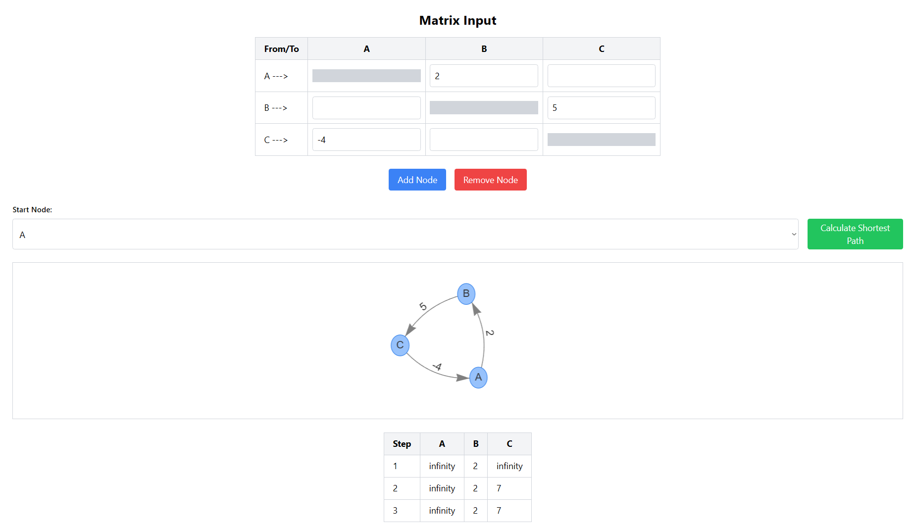

# **Shortest Path Visualization Tool using Bellman Ford**

The **Shortest Path Visualization Tool** is a React-based application designed to help users understand and visualize graph traversal algorithms, specifically focusing on calculating the shortest path between nodes. The tool provides an intuitive interface to create graphs, input edge weights, and compute shortest paths using algorithms like Bellman-Ford. This educational application is ideal for students, developers, and enthusiasts looking to explore graph theory concepts interactively.


## **Features**

- **Interactive Graph Creation**: 
  - Add or remove nodes dynamically.
  - Define edge weights using an easy-to-use matrix interface.
  
- **Algorithm Visualization**: 
  - Step-by-step computation of the shortest path.
  - Detailed history of each iteration displayed in tabular format.

- **Dynamic Rendering**:
  - Graphs are visualized in real-time using the Vis.js library.
  - Customizable starting node for shortest path calculations.

## **Technologies Used**

- **Frontend**: React.js
- **Visualization**: Vis.js for graph rendering
- **Styling**: TailwindCSS
- **State Management**: React Hooks for stateful interactions

## **How to Run the Project**

1. Clone the repository:

2. Install dependencies:
   ```bash
   npm install
   ```

3. Start the development server:
   ```bash
   npm start
   ```

4. Open your browser and visit `http://localhost:3000` to use the application.

## **Planned Improvements**

- Support for additional algorithms such as Dijkstra’s algorithm.
- Enhanced graph editing features, including drag-and-drop functionality.
- Real-time alerts for negative weight cycles.
